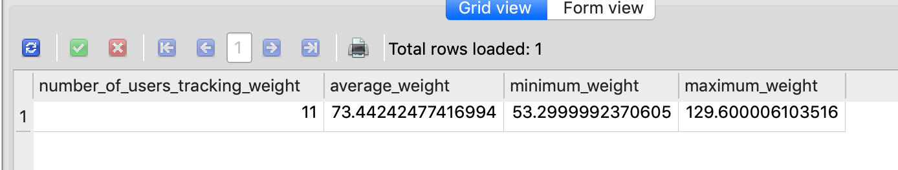

# Bellabeat Case Study
### Annika Smith

[Ask](#ask)

[Prepare](#prepare)

[Process](#process)

[Analyze](#analyze)

[Share](#share)

[Act](#act)


## Ask

#### Business Task:

Analyze smart device data to gain insight into how consumers are using their smart devices and help Bellabeat become more competitive in the smart device fitness game.  Analyze smart device usage data to show how people are already using their smart device.  Use this data to inform the Bellabeat marketing team on new marketing strategies.  Select one Bellabeat product to apply these insights to.
  
#### Stakeholders:

- **Urška Sršen:** Bellabeat’s cofounder and Chief Creative Officer 
- **Sando Mur:** Mathematician and Bellabeat’s cofounder; key member of the Bellabeat executive team
- **Bellabeat marketing team**

## Prepare

My data is stored in the Bellabeat database stored locally on my device.  The data is organized into tables.  The tables are organized into the following categories: daily activities (wide), daily calories (long), hourly calories (long), minute calories (long), daily intensities (long), hourly intensities (long), minute intensities (long), daily steps (long), hourly steps (long), minute steps (long) heart rate (long), minute METs (long), minute sleep (long), time asleep (long), and weight info (long).

The tables that were used for this analysis are the tables below:
- dailyActivities_merged.csv 
- heartrateSeconds_merged.csv
- hourlyActivity.csv (see [Process](#process))
- minuteSleep_merged.csv
- sleepDay_merged.csv
- weightLogInfo_merged.csv

#### About the data:

- **Reliable:**  This dataset tracks the data from 30 Fitbit users.  These users consented to having their personal data about their physical activity, heart rate, and sleep monitoring recorded and shared.  These users responded to a survey conducted by Amazon Mechanical Turk.  This dataset is reliable.
- **Original:**  The data was collected by a third party.
- **Comprehensive:**  While this dataset does contain very detailed data down to the minute, the sample size is rather small at 30 users.  In order to gain a more comprehensive view of the data, a larger sample size would be required.
- **Current:**  This data was collected March 12, 2016 - May 12, 2016.  This is not the most current dataset and we should take this into consideration when analyzing our data.
- **Cited:**  This dataset was collected from a third party and does not contain a citation on Kaggle.


## Process

I began by creating a database on my local device to store my data.  I did this by creating a file called Bellabeat.db in my Finder.

Next, I created tables in SQLite and defined the data type for each column.  I downloaded the .csv files and saved them in the folder with my database.  Then, I used the terminal to load the csv files into SQLite using the below code.  I repeated this process for each table in my database.

```
cd Projects
cd “Data Course”
cd Bellabeat
sqlite3 Bellabeat.db
.mode csv
.import ‘weightLogInfo_merged.csv’ weightLogInfo
```

To clean my data, I began by merging hourlyCalories_merged.csv, hourlyIntensities_merged.csv, and hourlySteps_merged.csv.  I did this in Google Sheets using VLOOKUP.  I saved this new merged file as hourlyActivity.csv.

I uploaded hourlyActivity.csv to SQLite using the same process outlined at the end of the [Prepare](#prepare) section.  

I reviewed all the data types in each of my tables to make sure that the data type matched the actual values.  

## Analyze

#### Tracking Number of Users and Daily Averages
First, we want to review the number of users that are tracking their physical activity as well as the daily averages for each data point.

``` 
SELECT
    COUNT(DISTINCT ID) AS number_of_users_tracking_activity,
    AVG(TotalSteps) AS average_steps,
    AVG(TotalDistance) AS average_distance,
    AVG(Calories) AS average_calories
FROM 
    dailyActivity;
```


This query tells us that we have a total of 34 users tracking their physical activity.  The total average steps taken was 7633.85 with an average distance of 5.49 miles and 2302.38 calories.

#### Tracking Number of Users and Average Heart Rate
Next, we will review how many users are tracking their heart rate as well as the average heart rate, minimum heart rate, and maximum heart rate.

```
SELECT
    COUNT(DISTINCT ID) AS number_of_users_tracking_heartrate,
    AVG(Value) AS average_heartrate,
    MIN(Value) AS minimum_heartrate,
    MAX(Value) AS maximum_heartrate
FROM 
    heartrate_seconds;
```


This query tells us that we have a total of 14 users that are using their smart device to monitor their heart rate with an average heart rate of 76.64 bpm, a minimum heart rate of 55 bpm and a maximum heart rate of 120 bpm.


We follow a similar pattern to track the number of users tracking their sleep and weight as well as the average hours of sleep and average weight.

#### Tracking Sleep
```
SELECT
    COUNT(DISTINCT ID) AS number_of_users_tracking_sleep,
    AVG(TotalMinutesAsleep)/60.0 AS average_hours_asleep,
    MIN(TotalMinutesAsleep)/60.0 AS minimum_hours_asleep,
    MAX(TotalMinutesAsleep)/60.0 AS maximum_hours_asleep,
    AVG(TotalTimeInBed)/60.0 AS average_hours_in_bed
FROM 
    sleepDay;
```


24 users are tracking their sleep.  These users are in bed for an average of 7.64 hours and are asleep for an average of 6.99 hours.  The minimum hours asleep was 0.967 hours and the maximum hours asleep was 13.267 hours.

#### Tracking Weight
```
SELECT
    COUNT(DISTINCT ID) AS number_of_users_tracking_weight,
    AVG(WeightKg) AS average_weight,
    MIN(WeightKg) AS minimum_weight,
    MAX(WeightKg) AS maximum_weight
FROM 
    weightLogInfo;
```


11 users are tracking their weight with an average weight of 73.44 kg.  The minimum weight was 53.3 kg and the maximum weight was 129.6 kg.

#### Tracking Number of Days Physical Activity was Recorded
Next, we will calculate the number of days each user tracked their physical activity and sort it in descending order.

```
SELECT
    DISTINCT ID,
    (DENSE_RANK() OVER (PARTITION BY ID ORDER BY ActivityDate asc) +
    DENSE_RANK() OVER (PARTITION BY ID ORDER BY ActivityDate desc) - 1) AS days_activity_recorded
FROM
    dailyActivity
ORDER BY
    days_activity_recorded desc;
```


Above is a snapshot of the number of days each user tracked their physical activity.  We can see that many users tracked their physical activity for 31 days, which was the maximum number of days.  One user only tracked their physical activity for 4 days.


#### Tracking Average Minutes of Activity by Category
Now, we are going to calculate the average minutes for each category of activity.

``` 
SELECT 
    AVG(VeryActiveMinutes) AS AverageVeryActiveMinutes,
    AVG(FairlyActiveMinutes) AS AverageFairlyActiveMinutes,
    AVG(LightlyActiveMinutes)/60.0 AS AverageLightlyActiveHours,
    AVG(SedentaryMinutes)/60.0 AS AverageSedentaryHours
FROM dailyActivity;
```


The average time that users were very active is 21.15 minutes.  The average time that users were fairly active was 13.56 minutes.  The average time that users were lightly active was 3.21 hours.  The average time that users were sedentary was 16.51 hours. 

#### Determining Time When Users Were Most Active
Next we will want to determine the time when users were the most active.  We will do this by examining the average intensity for each hour of the day.

I started by splitting the Date/Time column into just the time.  I ran two separate queries to add a new column for just the time.

```
ALTER TABLE hourlyActivity
ADD ActivityTime
```

```
UPDATE hourlyActivity
    SET ActivityTime = SUBSTR(ActivityHour, INSTR(ActivityHour, ' ')+1)
```

Then I used the PARTITION BY statement to calculate the average intensity for each hour of the day and sorted in descending order.
```
SELECT DISTINCT
    ActivityTime,
    AVG(TotalIntensity) OVER (PARTITION BY ActivityTime) AS AverageIntensity
FROM 
    hourlyActivity;
ORDER BY 
    AverageIntensity DESC
```


This tells us that the most active hour of the day is 7:00pm and the least active hour of the day is 3:00am.

## Share


This visualization shows us the total number of Calories burned compared to the total number of steps.  We can see that we have a positive trend line indicating that the more steps taken, the more Calories are burned.


This visualization shows us the how many users had a specific heart rate at some point in the time recorded.  We can see that the minimum heart rate was around 55 and the maximum heart rate was 120.  


This histogram shows us the number of users by total hours asleep.  We can see that the maxmimum hours asleep was a bit over 13 hours and the minimum hours asleep was less than 1.  We can see that most users slept around 7 hours.

.png>)

This histogram tracks the weight of users in Kg.  We can see the minimum weight was around 53 Kg and the maximum weight was around 129 Kg.  The weight of most users fell around 73 Kg.


This pie chart tracks the percentage of minutes per day by activity.  We can see that users are primarily sedentary.  However, we must take into account sleep time.  Users will be sedentary during the hours they are asleep.  If we look at just the time when users are active, we can see that users are mostly lightly active.


This line graph shows us the average intensity by hour of the day.  We can see that the most active hour of the day is 7:00pm with the least active hour of the day being 3:00am.

## Act

Based off the above analysis we have come to the following conclusions:

- The more steps taken, the more calories are burned.
- When users are active, they are primarily lightly active.

    - Recommendation: Initiate daily step competitions between users to encourage users to take more steps. Users can earn points based on the number of steps taken and use points to unlock workout videos.  The higher intensity of the workout, the more points they can earn. 

- The average heart rate among users was 76.6.

    - Recommendation: Incentivize users to get their heart rate up by earning more points for a higher average heart rate.  Recommend workouts intended to elevate heart rate when users are low on points.  If heart rate reaches unsafe levels, alert the user to seek medical attention.

- Users slept fot an average of 7 hours a day.
    
    -  Recommendation: Set sleep goals for users.  Use sleep goal to determine when users should be going to bed and send notifications to user on when they should start winding down and shutting off their devices.  

- The average weight of users was 73 Kg.  

    - Recommendation: Allow users to set weight goals.  Consider allowing users to include body measurements to take into account weight gained from muscle gain.

- The most active hour of the day is 7:00pm.  

    - Recommendation: Set up "Happy Hours" where users can earn more points for completing a workout within that time period.  Provide incentives to users who workout early in the day.
